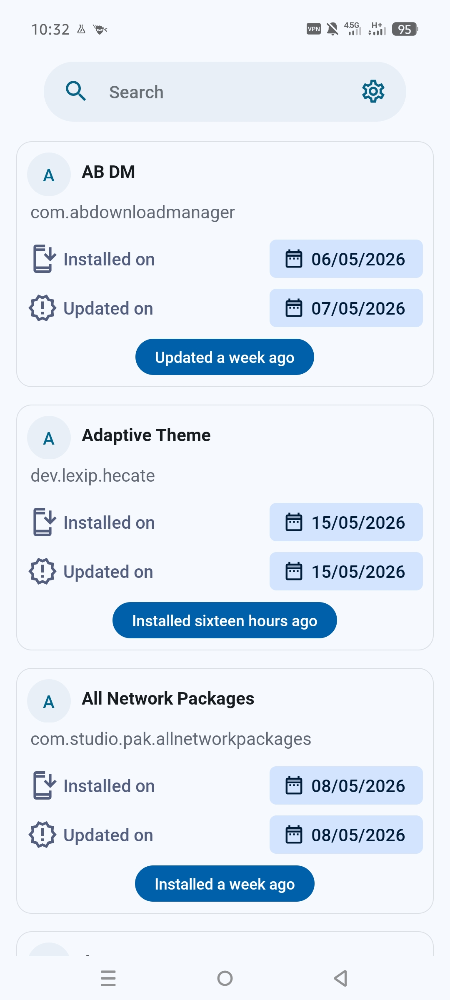
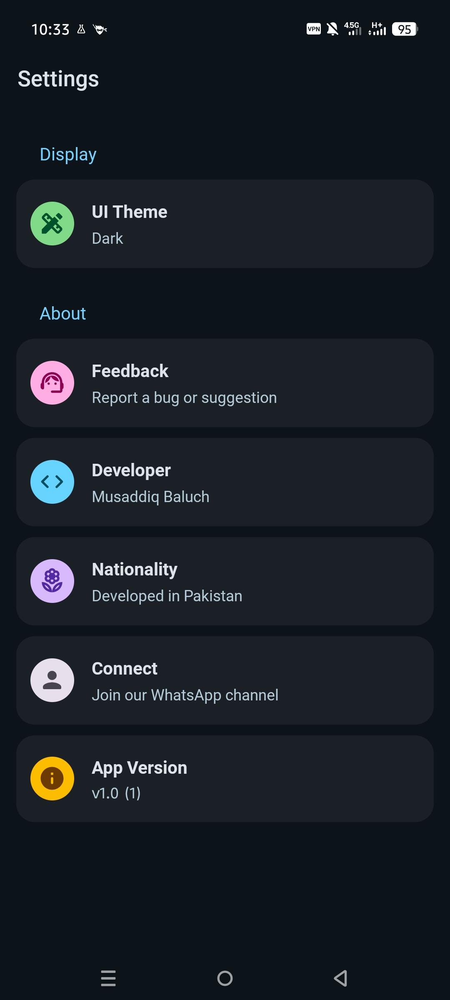

# Lapse-M

Lapse is a lightweight Android app that helps you track when apps were installed or last updated, making it easier to identify outdated apps and replace them when necessary.

## Features
- Track app install dates
- Track app update dates
- Lightweight and fast
- Privacy focused
- No ads or tracking

## Screenshots

